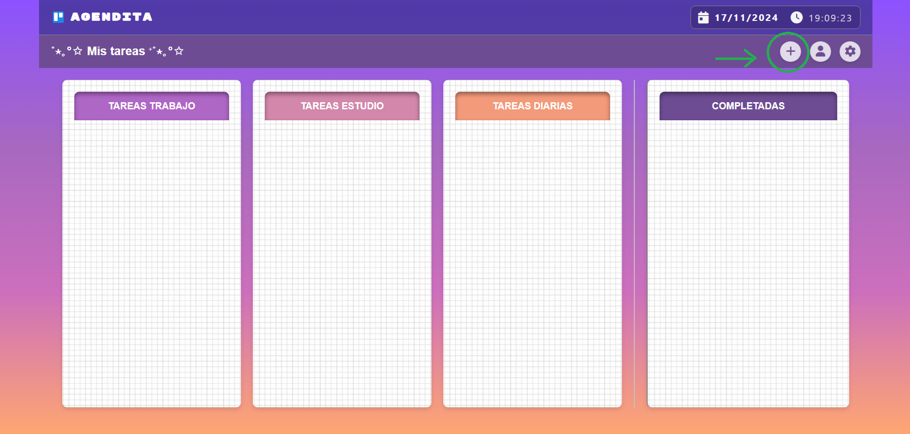
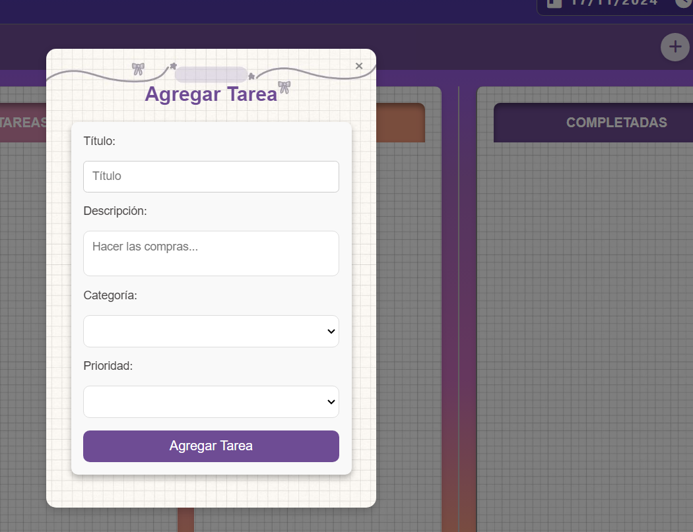
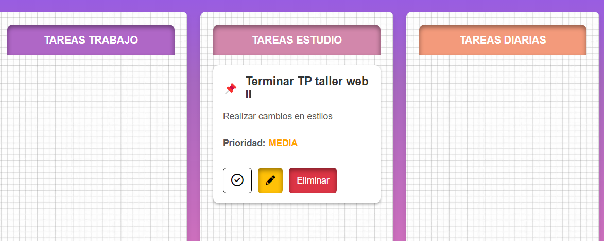
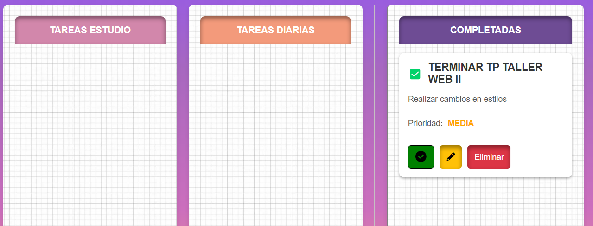

# Agenda para Gestión de Tareas con Angular

## Descripción
Este proyecto es una aplicación de gestión de tareas desarrollada con Angular, Node.js y MongoDB. Permite crear, editar, eliminar y organizar tareas en diferentes categorías.

## Integrantes
- *Ludmila Pereyra*
- *Celena Moscovich*
- *Micaela Zara*
- *Celeste Gomez*
- *Axel Leguero*

## Características
- Crear tareas con título, descripción, prioridad y categoría.
- Editar tareas existentes desde un popup modal.
- Eliminar tareas con un solo clic.
- Marcar tareas como completadas.

## Tecnologías
- **Frontend**: Angular 18
- **Backend**: Node.js
- **Base de datos**: MongoDB

## Instalación
1. Clona este repositorio:
   ```bash
   git clone https://github.com/Celesgz/tallerAgenda.git

2. Instalación de dependencias: en las carpetas tareas-backend y lista-de-tareas utiliza el comando ***'npm install'*** para instalar las dependencias utilizadas en el proyecto.
   
3. En la carpeta tareas-backend (***'cd tareas-backend'***) usa el comando ***'node server.js'*** para ejecutar el backend de la aplicación.
- **Debes tener previamente instalado MongoDB.** Si no lo tienes instalado, descárgalo de su [página oficial](https://www.mongodb.com/try/download/community).
  -. Descarga el instalador de MongoDB desde la página oficial.
  -. Sigue las instrucciones del instalador para completar la instalación.
  - Abre una terminal y ejecuta el siguiente comando para iniciar el servidor de MongoDB:
    ```bash mongod ```
  - Este comando iniciará el servicio de MongoDB en el puerto por defecto (27017).
  - Abre otra terminal y ejecuta el siguiente comando para conectarte a la base de datos:
    ```bash mongo ```
  - ¡Ahora MongoDB debería estar corriendo y listo para usar!

4. En la carpeta lista-de-tareas (***'cd lista-de-tareas'***) usa el comando ***'npm start'*** o ***'ng serve'*** para ejecutar el frontend de la aplicación.

## Uso
1. Navega a http://localhost:4200 para utilzar nuestra aplicación.
2. Interactúa con la aplicación para gestionar tus tareas.

## Interfaz

### Home

- Al hacer click en el simbolo "+" se despliega el popup para agregar una nueva tarea.

### Agregar Tarea

- Podemos completar el formulario indicando un titulo, descripción, categoría (Estudio, Diario o Trabajo) y una prioridad (Alta, Media o Baja)

### Tarea guardada en su categoría

- Una vez guardada,se mostrara según el tipo de categoría de la tarea en su respectiva columna. Podemos seleccionar la tarea como completada, editarla o eliminarla.

### Tarea completada

- Una vez marcada como completada pasa a la columna de completadas donde puede ser eliminada, eliminada o marcarla nuevamente como pendiente (en caso de haber marcado por error la opcion de completada).
